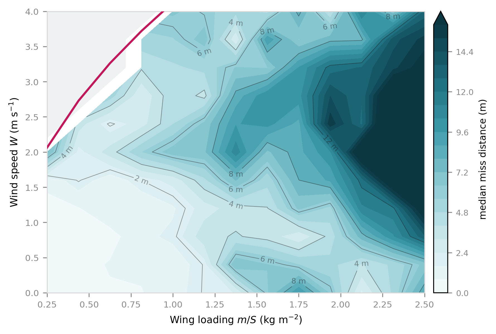

# Airdrop Trajectory Optimisation for Disaster Relief

### Guiding Supply Packages to a Target in Unknown Wind

## ▶ [**Try it: 1101-hub.github.io/guided-airdrop**](https://1101-hub.github.io/guided-airdrop/)

Drop a package yourself — set the wind, the height and the weight, and watch it steer itself down.
No install, works on a phone.

📄 [**Read the paper (PDF)**](synopsis.pdf) · 1,000 words, IMRaD

---

A mathematical model of a self-steering parachute that works out the wind with no wind sensor — and the scaling law that decides how accurately any such system can land.

During monsoon floods, relief supplies are dropped from helicopters that cannot land. The packages
drift with the wind and frequently miss — landing in water, in trees, or on the wrong side of a river
from the people waiting for them.

Guided parafoils solve this. Military systems do it at tens of thousands of dollars per unit, and
**open-source hobbyist projects have already shown it can be done for far less** — see
[Prior art](#prior-art). **This is not the first cheap guided parafoil.**

What this project does is derive the whole system from first principles and then ask a question the
existing projects do not: **how accurately can such a thing possibly work, and what decides that?**
The answer turns out to be a single design number, and it obeys a clean scaling law.

The existing projects are devices that fly. This is an analysis of what determines whether they fly
*accurately*.

**[Full explanation of the project and the maths](EXPLAINER.md)**



---

## Headline results

Simulated over 150 drops — wind 0–3.2 m/s from any direction, release height 20–60 m, compass bias
±12°, GPS noise 0.25 m/s.

| Guidance knows... | Median miss | Within 5 m |
|---|---|---|
| Nothing (assumes still air) | 8.57 m | 34% |
| **Wind estimated in flight by the EKF** | **3.89 m** | **56%** |
| The true wind (idealised upper bound) | 4.62 m | 53% |

**The filter beats knowing the true wind.** Knowing the wind perfectly does not help if the compass
is 12° out, and the filter recovers the compass bias as well as the wind. It estimates the wind
vector to a median error of **0.10 m/s** using nothing but a GPS and a compass — no wind sensor.

---

## The mathematics

### 1. Descent physics — `model/parafoil.py`

A parafoil is a wing, so it glides rather than falling. Its behaviour is set almost entirely by
**wing loading** (payload mass divided by canopy area):

```
airspeed     v ~ sqrt(loading)
turn radius  R ~ v^2 ~ loading        (rises linearly)
sink rate      ~ v ~ sqrt(loading)
```

The hard constraint is **wind penetration**. If airspeed is below wind speed, the parafoil is blown
backwards no matter what the guidance commands. That is geometry, not a software problem.

### 2. Dubins paths — `model/dubins.py`

A parafoil cannot turn sharply, so a straight line to the target is usually unavailable. Dubins
proved in 1957 that the shortest legal route is **always one of exactly six shapes** — turn-straight-turn
in the four left/right combinations, plus two all-curve cases. An infinite-dimensional problem
("what is the best possible curve?") collapses to picking the smallest of six numbers.

All six are implemented and verified against step-by-step integration to **1e-12 m**.

### 3. Guidance — `model/guidance.py`

Sink rate is constant, so **time aloft is fixed the moment it is released**. Two things follow:

- **The wind stops being complicated.** In time `t` the air mass slides downwind by exactly `wind*t`,
  so shifting the target upwind by that much turns it into a no-wind problem. No iteration.
- **Path length is fixed too**, at `airspeed * t`. So the goal is not the *shortest* route — it is a
  route of **exactly the right length**. If the direct path is shorter than the budget, height must
  be deliberately wasted. Real precision airdrop calls this *energy management*.

The controller flies at an angle to the target, chosen so the path stretches by exactly the required
factor:

```
cos(alpha) = distance / budget
```

Need 20% more path? Fly 33.6° off. As height runs out the ratio rises to 1, alpha falls smoothly to
zero, and the weave straightens into a final approach — with no mode-switching logic. When there is
too much height even for the steepest weave, it orbits instead, making zero net progress until the
numbers come good.

### 4. Wind estimation — `model/ekf.py`

```
ground velocity = air velocity + wind    =>    wind = ground velocity - air velocity
```

An Extended Kalman Filter with state `[wx, wy, airspeed, compass bias]`. The bias term is what makes
it genuinely nonlinear; with a perfectly known heading the problem would be linear.

**Observability is the interesting part.** On a single heading, wind and airspeed error are
indistinguishable — a 1 m/s headwind looks exactly like flying 1 m/s slower. Turning separates them,
because the wind stays fixed in the world frame while the airspeed contribution rotates.

And the parafoil is already turning constantly, because that is how the guidance burns excess height.
**The manoeuvre that manages energy is the same one that makes the wind observable.**

### 5. Design chart — `model/design.py`

Combining the wind-penetration floor with the turn-radius accuracy ceiling:

```
loading needed to beat wind W   ~  W^2
best achievable turn radius     ~  W^2
```

**Accuracy is capped by the square of the wind speed you design for.** So the correct design is the
*lightest* one that still penetrates the expected wind with a margin — over-building for wind you
will not meet costs accuracy on every drop, including the calm ones.

Usefully, wing loading is tunable on the day: the canopy is fixed once bought, but ballast is not.

---

## Bugs the tests caught

Both were found by checks written to be capable of failing, and both would have produced wrong results.

- **Dubins LRL.** The closed-form segment lengths were compared against actually stepping along the
  path. The final-arc term had dropped a minus-t and doubled p: a 13 m position error and 120° of
  heading error.
- **Energy management is discontinuous.** Path length versus approach distance *jumps* — by nearly
  one full turning circle — when the optimal Dubins type switches. Bisection was bracketing across
  the cliff and converging on its edge. Candidates are now verified after the root-find, and loiter
  circles fill the gaps.

The flight controller itself took four iterations. Following a precomputed plan open-loop failed
because the loiter circles were computed but never flown. Pure weaving failed with large excess
height — it sailed over the target at 6 s with 20 m still to lose. Adding the orbit phase fixed that,
and charging the alignment turn to the budget (Dubins length rather than straight-line distance)
fixed the rest.

---

## Layout

```
model/
  parafoil.py   descent physics, wing loading, wind penetration
  dubins.py     six shortest-path types, verified exact
  guidance.py   air-frame transform, energy management, flight controller
  sim.py        full descent with realistic sensor noise
  ekf.py        wind, airspeed and compass bias from GPS alone
  design.py     the design chart
```

```bash
pip install numpy scipy matplotlib
cd model && python design.py
```

## Prior art

Guided parafoils are a solved problem at several price points. Anyone building one should know this
list, and this project makes no claim to be first.

| | What it is |
|---|---|
| **[ParaDrone](https://hackaday.io/project/176779-paradrone-autopilot-for-parachutes)** | Open-source autopilot for parachutes and paragliders. Servos pull the left and right brake toggles, runs on an Arduino-class microcontroller, and **plans with Dubins paths** — the same mechanical and algorithmic approach used here. [Flight manual](https://paradr.one/ParaDrone.pdf). |
| **[R2Home](https://hackaday.com/2021/01/07/gps-guided-parachutes-for-high-altitude-balloons/)** | Open-source GPS-guided parachute for returning high-altitude balloon payloads. Teensy 4.1, GPS, digital compass. |
| **[NPS Snowflake](https://nps.edu/web/adsc/snowflake)** | Naval Postgraduate School research platform for miniature precision airdrop. Landed within 3 m of target from 3,000 ft. |
| **JPADS** | The military systems, at tens of thousands of dollars per unit. |

The mechanical architecture (two servos on the brake lines), Dubins path planning, and the disaster
relief application are all established. What this project adds is the **design analysis** — the map of
how accuracy depends on wing loading and wind speed, and the resulting scaling law. That is a
statement about the class of systems rather than another instance of one.

## Status

Model complete. Hardware next — the design chart determines the canopy size, payload mass and
minimum release height, so the parts list follows from the maths rather than from guesswork.

## Licence

Code MIT. Documentation CC BY 4.0.
